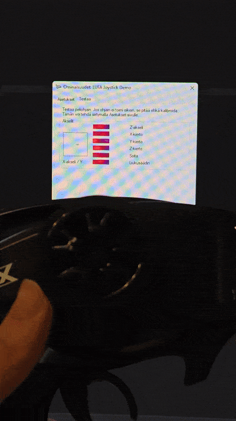

# RC to Joystick (with Sparkfun Pro Micro)

This Sparkfun Pro Micro 5v (or a clone) firmware can be used to make a joystic from your radio controller transmitter and receiver. It supports 6 channels out of the box. It allows you to play e.g. FS One 2022 or any game really on your PC using your RC car or plane controller.

Prebuilt binary release is available for downloading in the [Releases](https://github.com/veikkos/rc-to-joystick/releases) section.

Underneath LUFA HID Joystick library is used create the joystick.

## Usage

Connect the GND, 5V and the channels to your receiver like shown.

### Filtering

Ground PF6 or connect it to PF7 to enable optional input filtering to reduce noise in the channels.
